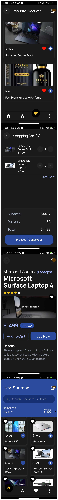

# PLENA-FINANCE



# Plena Finance:Task (Completed)

## In this task I have created all the required functionalities according to the document given to me.


## Demo Video

[Open Video](https://drive.google.com/file/d/1Nv-9ZHVy2AAwe2eLSw5mc20l_W2gxyQw/view?usp=sharing)

## Project Overview

This React Native project is designed to create a mobile app with three screens:

### Screen 1 - Home Screen

- Display a list of products.
- Provide options to add products to the cart and favorites.
- Show product details like name, thumbnail, and price.

### Screen 2 - Product Details Screen

- Display product images in a carousel.
- Show product price, title, and description.
- Include a back button to navigate back to the Home Screen.
- Provide options to add the product to the cart or initiate a purchase
- Option add product to favourites

### Screen 3 - Cart Screen

- Display the selected products in the cart.
- Allow users to increase or decrease the quantity of products.
- Increase or decrease the total amount based on products in cart

## Installation

Clone this project's repo with:

```
git clone https://github.com/sourabh58/PleaFinance
cd sourabhplenafinance
```

Then install all the packages using `yarn`:

```
yarn
```

Install the app on your **Android Emulator**:

```
npx expo run:android
```

Then, start the development server:

```
yarn start --clear
```

Now open the app on your **Android Emulator** by pressing `a` from the options given in the terminal.

## API Reference

#### Get all items

```
https://dummyjson.com/products
```

#### Get a single item

```
https://dummyjson.com/products/<id>
```

## Tech Stack

- **React Native(Expo)** : For Building The App
- **Tailwind CSS**: For Building The Design Of The App
- **Zustand** : For Global State Management For The Cart and Favourite Products Page
